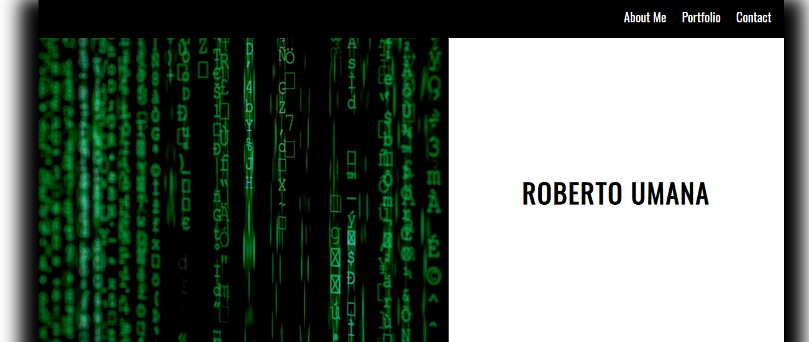

# Portfolio
A portfolio shell was created to illustrate ability to write and navigate HTML/CSS code ensuring functionality, styling,resizing in order to display work for future employer by demonstrating competency of HTML and CSS

The code is written in HTML/CSS

[Portfolio](git@github.com:robumana/Portfolio.git)
